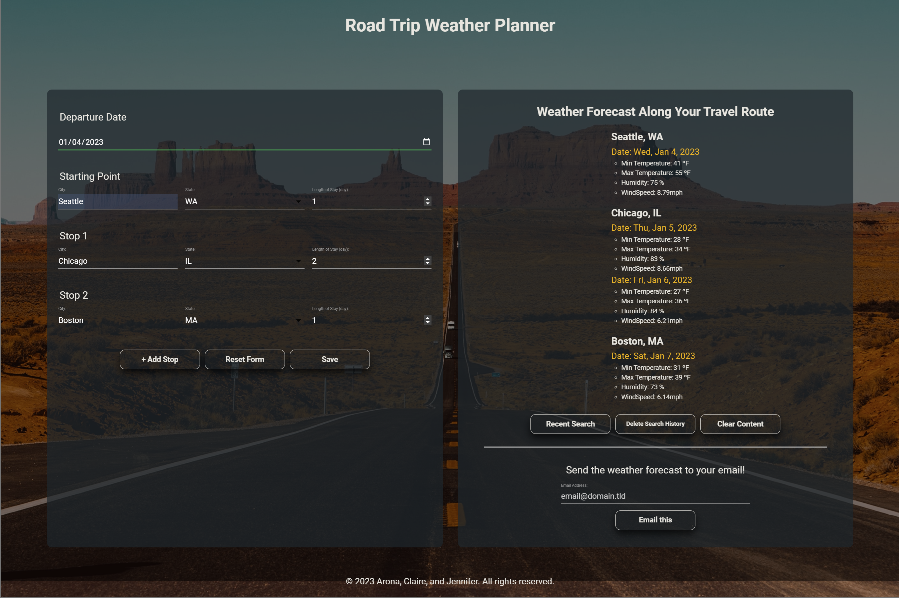

<!-- omit in toc -->
# Road Trip Weather Planner

<!-- omit in toc -->
## Description
This is a co-created application built with two third-party APIs, OpenWeather Geocoding API and Dark Sky Time Machine API, to help people with properly dressing for their road trips across the united states and/or to help them in their planning altogether.
 
 
When the webpage is initialized, the user is presented with a landing page which serves soley as an introduction to the main application. When the user clicks the button on the index page, the user is redirected to the dashboard page with a search form on the left-hand side and a search result box on the right-hand side. The user can enter the departure date, citis, states, and number of days to stay in each city. The user can add as many more stops as the user wants by clicking the add stop button on the form. Clicking the reset form button will reset the form into its default format. The client-side form validation is used with autocomplete, select option, and min attribute to ensure all requird form controls are filled out in the correct format. When the save button on the form is clicked, it will fetch city coordinates and weather forecast data from the third-party APIs for the entire travel itinerary and display them on the result box on the left-hand side. The last search data is automatically saved in the local storage and can be retrieved or deleted using the buttons on the page. The weather forecast data also can be sent to the user's email.
 
 
You can check out the deployed application from the link below:
 
[https://jenjen0219.github.io/road-trip-weather-planner/](https://jenjen0219.github.io/road-trip-weather-planner/)

<!-- omit in toc -->
## Table of Contents
- [Technologies](#technologies)
- [APIs](#apis)
- [Installation](#installation)
- [Usage](#usage)
- [License](#license)

## Technologies
Project is created with:
- [Materialize](https://materializecss.com/)

## APIs
Project uses:
- [OpenWeather Geocoding API](https://openweathermap.org/api/geocoding-api)
- [Dark Sky Time Machine API](https://rapidapi.com/darkskyapis/api/dark-sky)

## Installation
No special requirements.

## Usage
- Index page

- Dashboard page

- Dashboard page with serach result

## License
Claire Hyung Won Cho  
Main Contributor - HTML/CSS/Javascript & API Builder  
GitHub Profile: https://github.com/clairehwcho

Arona Gueye  
API & Javascript Builder  
Github Profile: https://github.com/roneprada

Jennifer Gutierrez Manjares  
API & Javascript Builder  
Github Profile: https://github.com/jenjen0219

